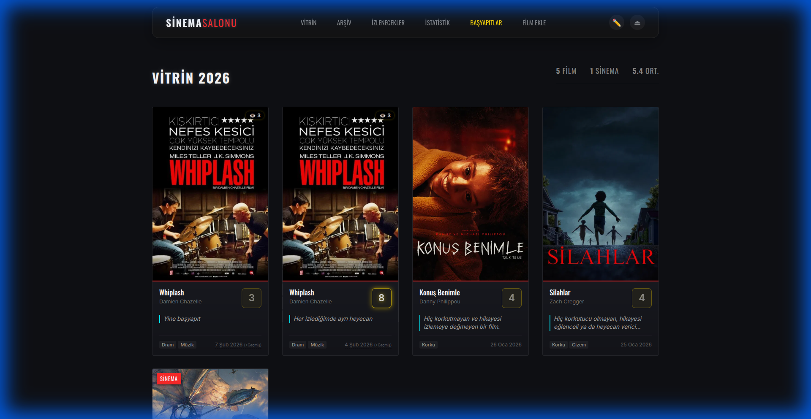
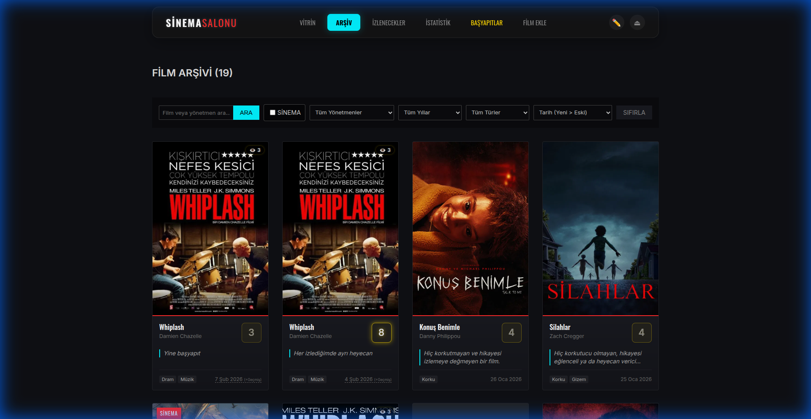
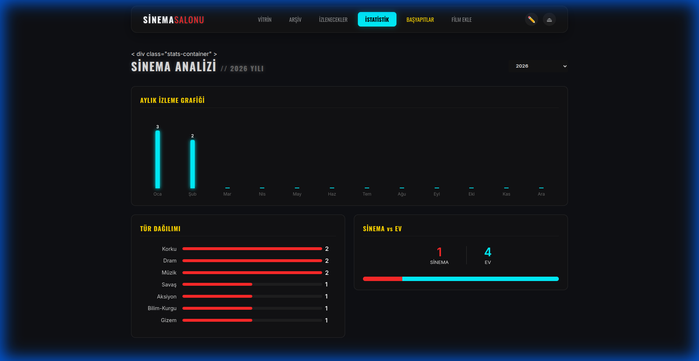
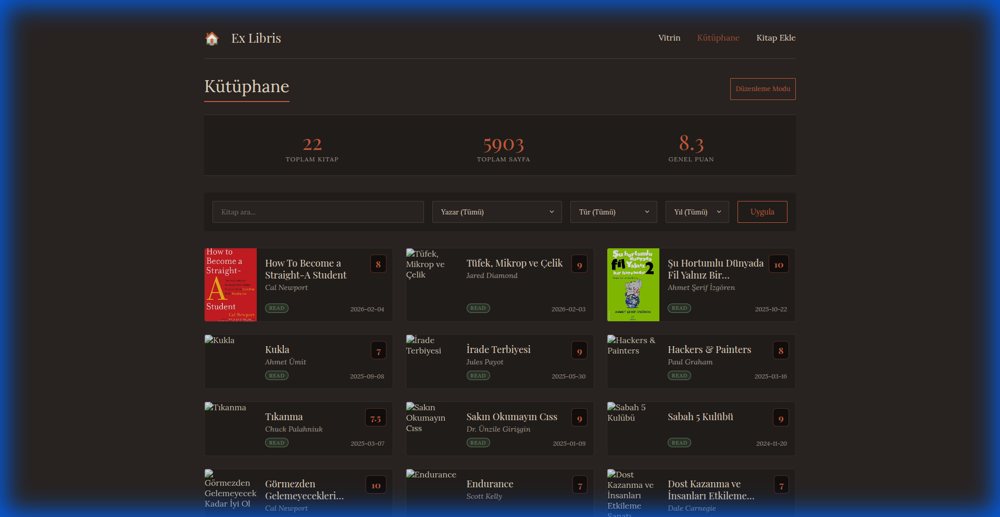

# Personal Media Database

> Developed with **Google DeepMind's Antigravity** and **Gemini 3 Pro**.

This project is a self-hosted, minimalist database system designed to track personal film and book consumption. It was built to solve the limitations of commercial platforms by offering full data ownership, offline capability, and specialized tracking features tailored to personal needs.

## Philosophy

The core goal is data sovereignty. Unlike cloud-based services, this application runs locally (or on a Raspberry Pi), ensuring that your reading and watching history remains private and accessible without an internet connection. It prioritizes speed, simplicity, and specific user-defined features.

## Features

*   **TMDB Integration:** Automatically fetches metadata (poster, director, year, rating) for films using the TMDB API.
*   **Custom Filtering:** Advanced filtering by director, genre, year, and watching status.
*   **Re-watch History:** Tracks multiple viewing dates for the same film.
*   **Cinema Mode:** Differentiates between films watched at home and films watched in a cinema theater.
*   **CSV Import (Notion):** Import your existing library exported from Notion or other CSV sources with column mapping support.
*   **Auto-Fetch & Sync:** Tools to populate missing metadata and synchronize actor details.
*   **Book Tracking:** A dedicated section for tracking reading progress and library management.
*   **Friend Integration (P2P):** Connect with friends via Tailscale to exchange film recommendations securely.

## 📸 Screenshots

### 🎥 Films
| Showcase |
|:---:|
|  |

| Archive (Filter & Search) | Analytics |
|:---:|:---:|
|  |  |

### 📚 Books
| Library & Tracking |
|:---:|
|  |

## Tech Stack

*   **Runtime:** Node.js
*   **Framework:** Express.js
*   **Database:** SQLite (via `better-sqlite3`) for a reliable, file-based database.
*   **Frontend:** Vanilla JavaScript and CSS (No heavy frameworks).

## Installation & Usage

This project is designed to be easily deployed on any system with Node.js support.

### Prerequisites
*   **Node.js**: **LTS Version (v20 or v22)** is required.
    *   *Warning for Windows Users:* Do not install v24 or "Current" versions as they may cause build errors with SQLite.
*   **Git**: To clone the repository.

### Setup Steps

1.  **Clone the Repository:**
    ```bash
    git clone https://github.com/Vialeth/personalDB.git
    cd personalDB
    ```

2.  **Install Dependencies:**
    ```bash
    npm install
    ```

3.  **Initialize Database:**
    The project excludes the database files (`database/*.db`) for privacy. You must run the setup script to create the necessary tables.
    ```bash
    npm run setup
    ```

4.  **Start the Server:**
    ```bash
    npm start
    ```
    The application will be accessible at:
    *   Local: `http://localhost:3001`
    *   Network: `http://<YOUR_IP>:3001`

### Updating
To get the latest features:
```bash
npm run update
```
*(Note: If you encounter conflicts, backup your `.db` files before updating)*

## Data Privacy
This repository contains only the application logic. The database files (`database/*.db`) and uploaded media (`public/uploads/`) are ignored by Git. When you run the project, it creates a local database that stays on your machine.
